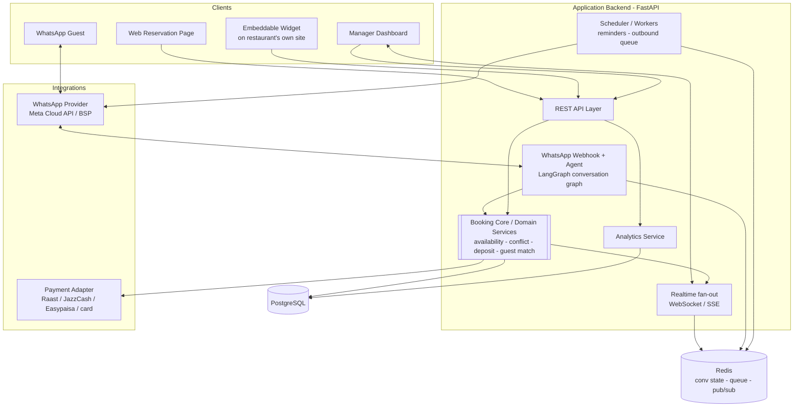
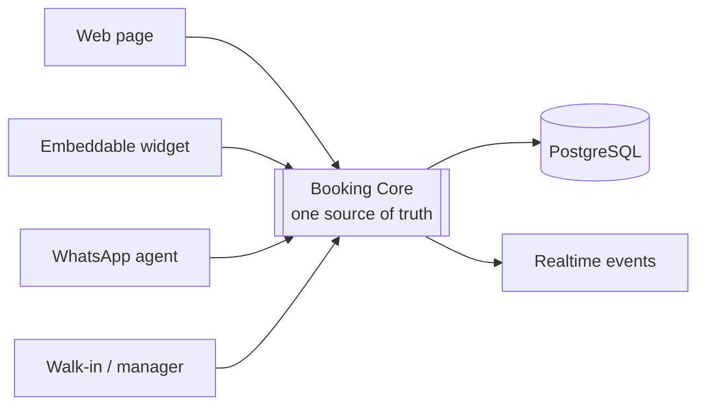
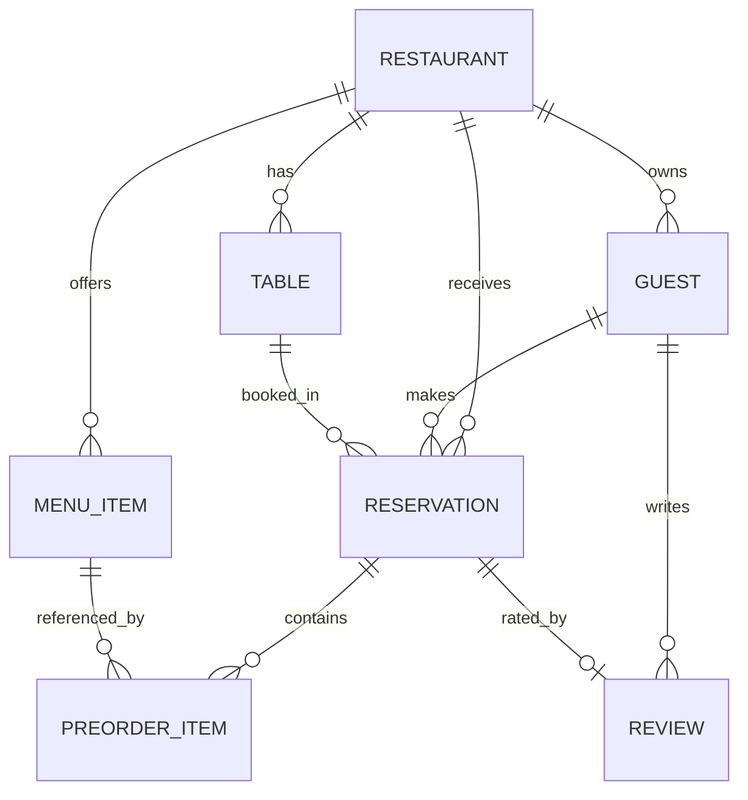
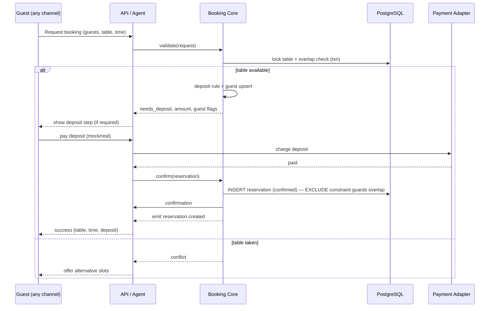
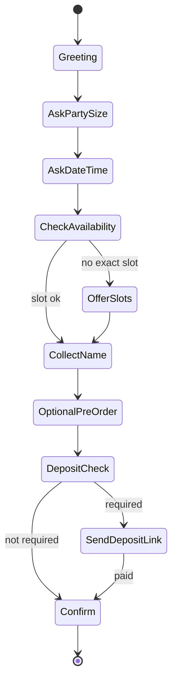
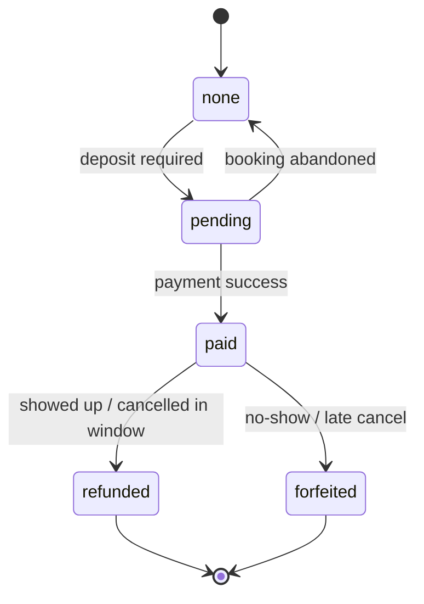

# Restaurant Reservation & Table Management Platform
## Architecture & Technical Design Document (B2B SaaS)

> **Audience:** engineering + product. This describes the production-leaning architecture and the booking domain logic, and clearly marks where the MVP simplifies. The MVP can ship frontend-only (localStorage + mock services), but the data shapes, channel boundaries, and the shared booking core below should hold from day one so nothing has to be re-architected later.

---

## 1. Overview & Goals

We sell a reservation + table-management platform **to restaurants** (the restaurant is the paying customer; diners book through tools the restaurant owns). The product is built around three differentiators, and the architecture exists to make these first-class:

1. **WhatsApp Booking Agent** — guests book by chatting; no app or website needed.
2. **Guaranteed covers via deposits** — high-value / peak / event bookings are secured with a configurable deposit, bringing revenue in before arrival and cutting no-shows.
3. **Own-your-guest CRM** — every diner's profile, order history, and reviews belong to the restaurant, not an aggregator.

**Design principle that governs everything:** a guest can book through three channels — the **web reservation page**, an **embeddable widget** on the restaurant's own site, and the **WhatsApp agent** — plus manager-entered **walk-ins**. All of them must flow through *one* booking core. Booking rules (capacity, conflict, deposit, guest-matching) live in exactly one place and are never re-implemented per channel.

**Non-goals (for now):** a consumer-facing restaurant discovery marketplace; a full marketing-automation suite; a full accounting/POS replacement (we integrate with POS rather than replace it).

---

## 2. High-Level System Architecture



**Layer responsibilities**

- **Clients** — three booking surfaces plus the operator dashboard. The widget is a separately bundled, theme-able build so it can render inside a third-party page.
- **REST API layer** — thin HTTP layer; validates input, delegates all business rules to the Booking Core. No booking logic lives here.
- **WhatsApp agent** — receives inbound messages via a webhook, runs a conversation graph (LangGraph), and calls the *same* Booking Core. It never talks to the database directly for booking decisions.
- **Booking Core (domain services)** — the single source of truth for availability, conflict prevention, deposit rules, and guest matching. Every channel goes through here.
- **Analytics service** — read-side aggregations for the ROI dashboard.
- **Realtime fan-out** — pushes booking/table events to connected manager dashboards.
- **Scheduler / workers** — send reminders and queued outbound WhatsApp messages; recompute denormalized guest stats if needed.
- **Integrations** — WhatsApp provider and payment provider sit behind adapters so the rest of the system never depends on a specific vendor.

---

## 3. Reference Tech Stack

Use the existing project's stack where one exists. Where it doesn't, this is the recommended reference (chosen to match a FastAPI/LangGraph/Postgres/React shop):

| Concern | Choice | Why |
|---|---|---|
| Web + manager UI | Next.js (React + TypeScript) + Tailwind | Single app for reservation page and dashboard; SSR where useful |
| Embeddable widget | Standalone bundle (lightweight React/Preact) or iframe of a widget route | Renders cleanly inside any restaurant's site, theme-able |
| Backend / API | FastAPI (async Python) | Fast, typed, and the natural home for the LangGraph agent |
| Database | PostgreSQL (SQLModel/SQLAlchemy + Alembic) | Relational data, strong constraints for conflict prevention |
| Conversation orchestration | LangGraph | The WhatsApp flow is a state machine — LangGraph's sweet spot |
| Cache / state / queue / pub-sub | Redis | Conversation state, outbound message queue, realtime fan-out |
| Realtime | WebSocket (or SSE) + Redis pub/sub | Live dashboard updates across workers |
| Background jobs | Celery / RQ / APScheduler | Reminders, scheduled outbound, stat rollups |
| Payments | Adapter interface (mock now) | Raast / JazzCash / Easypaisa / card drop in later |
| Auth (later) | JWT + role-based access | Manager login, multi-tenant isolation |
| Deploy | Docker; managed Postgres; Redis; frontend on Vercel or container | Standard, portable |

**MVP simplification:** the first prototype may run **frontend-only** with a mock service layer over `localStorage` (per the build prompt). Keep that service layer behind a clean interface so swapping it for the FastAPI client is a one-file change. In MVP, the WhatsApp agent is a **simulator harness** that drives the real conversation graph, and payments use the **mock adapter**.

---

## 4. Booking Channels & the Shared Core



Each channel collects inputs differently (a floor map click vs a chat message), but they all hand the Booking Core the same normalized request and receive the same decisions back:

- `check_availability(restaurant_id, guests, datetime)` → list of eligible tables/slots
- `evaluate_deposit(restaurant_id, guests, datetime, table)` → `{required, amount}`
- `upsert_guest(restaurant_id, name, phone)` → guest profile (+ recognition flags)
- `create_reservation(...)` → persists atomically with conflict checks
- emits a `reservation.created` event for the dashboard

This is the most important architectural decision in the system: **no channel contains booking rules.** A bug fixed once is fixed for all four entry points.

---

## 5. Data Model



Every row is owned by a `restaurant_id` (see multi-tenancy, §13). Phone number is the key that ties a diner to their CRM profile across all channels.

**Table**

| Field | Type | Notes |
|---|---|---|
| id | uuid | |
| restaurant_id | uuid | tenant |
| table_number | int | |
| capacity | int | seats |
| status | enum | `available · occupied · reserved · cleaning` |
| current_reservation_id | uuid? | when occupied/reserved |
| x, y | int? | floor-map layout |

**Guest** (CRM)

| Field | Type | Notes |
|---|---|---|
| id | uuid | |
| restaurant_id | uuid | tenant |
| name | string | |
| phone | string | **unique per restaurant** — the match key |
| email | string? | |
| total_visits | int | denormalized, updated on completion |
| total_spend | decimal | denormalized |
| average_party_size | decimal | denormalized |
| last_visit_date | date? | |
| preferences | text? | e.g. "window seat" |
| allergies | text? | |
| tags | string[] | `VIP · regular · repeat-no-show …` |
| birthday, anniversary | date? | for future marketing |
| created_at | timestamp | |

**Reservation**

| Field | Type | Notes |
|---|---|---|
| id | uuid | |
| restaurant_id | uuid | tenant |
| guest_id | uuid | link to Guest |
| customer_name, phone | string | snapshot at booking time |
| guests | int | party size |
| table_id | uuid | |
| reservation_start | timestamp | date + time combined |
| seating_duration_min | int | turn time (default per restaurant) — defines the slot window |
| status | enum | `confirmed · cancelled · completed · no-show` |
| source | enum | `web · widget · whatsapp · walk-in` |
| has_pre_order | bool | |
| pre_order_items | relation | PreOrderItem[] |
| deposit_required | bool | |
| deposit_amount | decimal | |
| deposit_status | enum | `none · pending · paid · refunded · forfeited` |
| total_spend | decimal? | filled on completion → feeds analytics |
| created_at | timestamp | |

**MenuItem:** id, restaurant_id, name, description, price, category, image?, available.

**PreOrderItem:** menu_item_id, reservation_id, name, quantity, price, total.

**Review:** id, restaurant_id, guest_id, reservation_id, rating (1–5), comment?, created_at.

**RestaurantConfig** (drives the deposit engine and branding): default seating duration, deposit rules (threshold party size, peak days/slots, percentage or fixed per-guest amount), branding (name, logo, primary color), widget API key.

**Analytics are computed, not stored:** covers, no-show rate, deposit revenue recovered, repeat-guest rate, and revenue per cover are all derived from the tables above.

---

## 6. Core Booking Logic

### 6.1 Availability

A reservation occupies a table for a **window** = `[reservation_start, reservation_start + seating_duration_min)`. A table is available for a requested slot if **no active reservation** (`confirmed`) overlaps that window, and `capacity >= guests`.

```
eligible_tables(restaurant, guests, start, duration):
    window = [start, start + duration)
    return tables where
        capacity >= guests
        AND status != 'cleaning'
        AND NOT EXISTS active reservation on this table
            whose window overlaps `window`
```

- **"Right now"** → `start = now`, and also respect live `status` (a table marked `occupied`/`cleaning` by the manager is excluded).
- **Future time** → purely overlap-based against existing reservations for that window.
- **Capacity filter** → only tables `>= guests` are selectable; smaller ones are returned as disabled/faded for the UI.

### 6.2 Conflict & double-booking prevention (important)

Two guests must never confirm the same table for the same slot. Defense in depth:

1. **Transactional check-then-insert** — the availability check and the insert happen in one DB transaction, taking a row lock on the target table (`SELECT … FOR UPDATE`) so concurrent bookings serialize.
2. **Database exclusion constraint** — a Postgres `EXCLUDE` constraint (via `btree_gist`) on `(table_id WITH =, tstzrange(start, end) WITH &&)` for active reservations makes overlapping confirmed bookings *impossible at the storage layer*, regardless of application bugs or race conditions.
3. **Idempotency key** on the booking `POST` so a retried request (flaky mobile network — common in our market) doesn't create a duplicate.

This trio is what lets us honestly tell a restaurant "you will never get a double booking."

### 6.3 Deposit rule engine

Pure, configurable, and used by every channel:

```
evaluate_deposit(config, guests, start, table):
    if config disabled: return {required: false}
    if guests >= config.large_party_threshold
       OR slot in config.peak_windows
       OR guest is flagged 'repeat-no-show':
        amount = config.fixed_per_guest * guests
                 OR config.percent_of_estimate
        return {required: true, amount}
    return {required: false}
```

### 6.4 Guest matching / upsert

On every booking (any channel): find guest by `(restaurant_id, phone)`; create if absent; attach `guest_id`; surface recognition flags (name, preferences, allergies, VIP / repeat-no-show). Denormalized stats (`total_visits`, `total_spend`, `average_party_size`, `last_visit_date`) are updated when a reservation reaches `completed`.

### 6.5 Booking sequence (with deposit)



---

## 7. WhatsApp Booking Agent

The agent completes a full booking inside a chat. It's built so the live provider is a **drop-in** later — the conversation logic never depends on the transport.

### 7.1 Conversation graph (LangGraph)



Each node calls the shared Booking Core for anything that touches availability, deposits, or guests. Conversation state (current node + collected fields) is stored in **Redis**, keyed by the guest's WhatsApp number, with a TTL so abandoned chats expire.

### 7.2 Provider adapter pattern

- **Inbound:** `POST /api/whatsapp/webhook` receives messages from the provider (Meta WhatsApp Cloud API or a BSP such as 360dialog / Twilio), verifies the signature, and feeds the message into the conversation graph.
- **Outbound:** a `WhatsAppProvider` interface with `send_message(to, payload)`. The MVP ships a **mock provider** + a **simulator UI** (a chat window in the manager app) that drives the exact same graph, so the full flow is demoable with no live number. Swapping to the real provider is one implementation of the interface.

### 7.3 NLU / parsing

Start with **structured, deterministic parsing** ("4 people", "tomorrow 8pm", "tonight") — cheap, predictable, easy to test. Keep it isolated behind a `parse_intent()` function so it can be upgraded to LLM-assisted extraction later without touching the graph.

### 7.4 Outbound messages

- **Confirmation** — on booking.
- **Reminder** — scheduled job fires N hours before `reservation_start` (cuts no-shows even without a deposit).
- **Deposit link** — mock link now; real payment-page link later.
- **"Your table is ready"** — when a waitlisted guest is seated.

Reminders and queued sends run through the **scheduler/worker**, not inline, so a slow provider never blocks a booking.

Every WhatsApp booking is tagged `source: "whatsapp"` and appears on the dashboard alongside web, widget, and walk-in bookings.

---

## 8. Embeddable Website Widget

- **Build:** a standalone, theme-able bundle the restaurant pastes into their own site as a script snippet or iframe. It does not depend on the main app's chrome.
- **Flow:** identical booking flow → posts to the same API → same Booking Core. Bookings tagged `source: "widget"`.
- **Theming:** primary color, logo, restaurant name via config props pulled from `RestaurantConfig`.
- **Security:** each restaurant gets a scoped **widget API key**; the widget endpoint accepts only its own restaurant's bookings, with CORS restricted to the restaurant's domain(s).
- **Settings UI:** an **embed-snippet generator** in the manager app with a live preview, so the owner copies a ready-to-paste snippet.

This is the "commission-free direct bookings from your own site" promise, made concrete.

---

## 9. Manager Dashboard, Realtime & ROI Analytics

### 9.1 Realtime updates

When the Booking Core creates/changes a reservation or a table status, it emits an event onto **Redis pub/sub**; the realtime layer fans it out to connected dashboards over **WebSocket** (or **SSE** if simpler). Across multiple backend workers, Redis is what keeps every dashboard consistent.

**MVP fallback:** if realtime isn't wired yet, the dashboard polls, or simply reflects new bookings on refresh. The event emission point stays the same, so turning on live updates later is additive.

### 9.2 ROI / analytics

Read-side aggregations over reservations/guests, with a time-range selector (today / week / month):

| Metric | Computation |
|---|---|
| **Deposit revenue recovered (hero metric, PKR)** | sum of `deposit_amount` where `deposit_status in (paid, forfeited)` in range |
| Total covers | sum of `guests` for `completed` (and seated) reservations |
| No-show rate | `no-show ÷ confirmed` in range |
| Repeat-guest rate | share of bookings whose guest has `total_visits > 1` |
| Revenue per cover | `total_spend ÷ covers` where spend exists |
| Covers over time / peak slots | grouped counts for simple charts |

Keep all of these in a dedicated **analytics helper/service** — nothing hardcoded, computed from live data. The hero number ("you recovered PKR X this month") is the retention hook and should be the most prominent element on the dashboard.

### 9.3 Operator controls

Live table map; mark table Available / Occupied / Reserved / Cleaning; add walk-in (marks table occupied, source `walk-in`); cancel or complete a reservation; capture post-visit reviews on completion.

---

## 10. Guest CRM

- **Auto-upsert** by phone on every booking — zero manual entry.
- **Profile** aggregates visits, spend, average party size, last visit, preferences, allergies, tags.
- **Order history** = the guest's reservations + their `PreOrderItem`s, so the manager sees what they ordered across visits.
- **Reviews** captured post-visit (1–5 + comment), stored against guest *and* reservation; surfaced as a per-guest and restaurant-wide average.
- **Recognition in the booking flow** (all channels): greet returning guests by name, show preferences/allergies, flag VIPs and repeat-no-shows so staff and the deposit engine respond.
- Built lean now, but structured so **WhatsApp marketing broadcasts and win-back offers** are a later addition on top of the same data.

---

## 11. Payments & Deposits

- **Adapter pattern:** a `PaymentProvider` interface (`create_charge`, `refund`, status webhook). MVP = **mock provider**; production implementations for **Raast / JazzCash / Easypaisa / card**.
- **Deposit lifecycle:**



- The reservation records `deposit_amount` and `deposit_status`; analytics totals `paid + forfeited` as **recovered revenue**. Refund/forfeit rules come from `RestaurantConfig` (cancellation window).

---

## 12. API Design (REST)

| Method | Path | Purpose |
|---|---|---|
| GET | `/tables` | list tables + live status |
| GET | `/menu-items` | menu for pre-order |
| GET | `/availability` | eligible tables/slots for guests + datetime |
| POST | `/reservations` | create booking (idempotency key) — used by web & widget |
| GET | `/reservations` | list (filters: date, status, source) |
| PATCH | `/reservations/:id/status` | cancel / complete / mark no-show |
| PATCH | `/tables/:id/status` | available / occupied / reserved / cleaning |
| POST | `/walk-in` | manager adds a walk-in |
| GET | `/guests`, `/guests/:id` | CRM list + profile (history, orders, reviews) |
| POST | `/reviews` | capture a post-visit review |
| GET | `/analytics` | ROI metrics for a time range |
| GET/POST | `/settings` | restaurant config: deposit rules, branding, widget key |
| POST | `/whatsapp/webhook` | inbound messages (provider adapter handles outbound) |
| WS/SSE | `/realtime` | dashboard event stream |

The HTTP layer stays thin; every endpoint delegates rules to the Booking Core / services.

---

## 13. Security, Auth & Multi-Tenancy

Because this is **B2B SaaS with many restaurants on one platform**, tenancy is a core architectural concern, not an afterthought:

- **Tenant isolation:** `restaurant_id` on every table and every query; never trust a client-supplied tenant id — derive it from the authenticated session (manager) or the scoped key (widget/webhook).
- **Manager auth (when added):** JWT + role-based access (owner / manager / host) so a host can't see revenue.
- **Widget keys:** per-restaurant scoped API keys with domain-restricted CORS.
- **Webhook security:** verify provider signatures on the WhatsApp webhook; reject unsigned calls.
- **Guest PII:** phone/email/preferences are personal data — restrict access to the owning restaurant, plan for export/delete, and keep deposits handling PCI-aware by delegating card data to the payment provider (never store raw card data).

The MVP can ship the manager dashboard open at `/manager/...`, but build the tenant and role seams now so auth is additive.

---

## 14. Deployment & Environments

- **Containerized** services (Docker): backend (FastAPI + workers), Redis, Postgres.
- **Frontend** on Vercel or as a static/container build; **widget** published as a versioned static bundle on a CDN.
- **Managed Postgres** (with the `btree_gist` extension enabled for the exclusion constraint) and **managed Redis**.
- **Environments:** `dev` (mock providers, seed data) → `staging` (sandbox WhatsApp + sandbox payments) → `prod`.
- **Migrations** via Alembic; **seed script** loads the sample 9-table layout and menu.

---

## 15. MVP vs Production

| Area | MVP (ship now) | Production target |
|---|---|---|
| Storage | localStorage + mock service layer | PostgreSQL + API |
| WhatsApp | simulator harness driving the real graph | Meta Cloud API / BSP via adapter |
| Payments | mock adapter | Raast / JazzCash / Easypaisa / card |
| Realtime | poll / refresh | WebSocket + Redis pub/sub |
| Auth | open dashboard, tenant seams in place | JWT + roles + full tenant isolation |
| Conflict prevention | transactional check | + DB exclusion constraint + idempotency |
| CRM | profiles, history, reviews, recognition | + WhatsApp marketing / win-back |
| Hosting | single app | containerized services + CDN widget |

**Roadmap phases**

1. **Phase 1 — core operator product:** web booking + live table map + manager dashboard + deposit (mock) + ROI hero metric. A complete, demoable, sellable product.
2. **Phase 2 — channels:** WhatsApp agent (simulator → real) + embeddable widget + reminders.
3. **Phase 3 — data moat:** full Guest CRM, reviews, recognition; analytics depth.
4. **Phase 4 — production hardening:** real payments (Raast first), auth + multi-tenancy, realtime, POS integration, multi-branch.

---

## 16. Suggested Project Structure

```
/frontend                  # Next.js (web reservation page + manager dashboard)
  /app
    /reservations          # customer booking flow
    /reservations/success
    /manager
      /dashboard           # stats + ROI panel + table map
      /reservations        # reservation list
      /guests              # CRM list + profiles
      /whatsapp            # agent simulator / inbox
      /settings            # deposit rules, branding, embed snippet
  /components              # TableMap, TableCard, ReservationForm, DepositPanel,
                           # RoiDashboard, GuestList, GuestProfile, ReviewForm, ...
  /lib/services            # API/mock service layer (single swap point)

/widget                    # standalone embeddable booking bundle

/backend                   # FastAPI
  /api                     # thin HTTP routes + whatsapp webhook
  /core                    # Booking Core: availability, conflict, deposit, guest-match
  /agent                   # LangGraph conversation graph + provider adapter
  /analytics               # ROI metric calculations
  /payments                # payment adapter (mock + real)
  /realtime                # ws/sse + redis pub/sub
  /workers                 # reminders, outbound queue, stat rollups
  /models                  # SQLModel/SQLAlchemy + Alembic migrations
  /seed                    # sample tables + menu
```

The **single most important rule** to preserve as the codebase grows: booking rules live only in `/backend/core`, and all four channels (web, widget, WhatsApp, walk-in) call into it. Everything else can change freely without risking divergent booking behavior.
